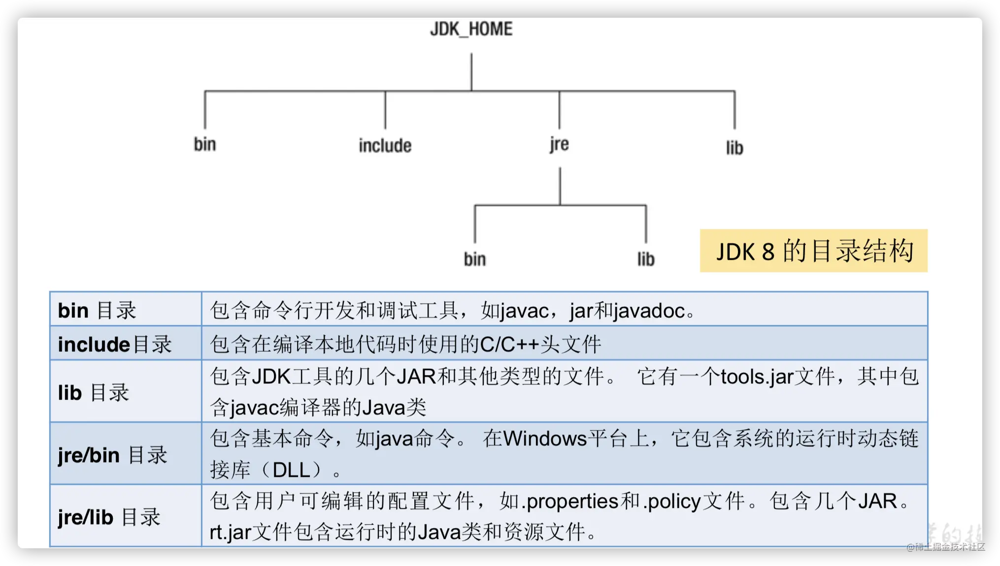

- bin
  - 是binary（字节码）的缩写，里面存放了JDK的各种工具命令即JDK开发工具的可执行文件（文件都是二进制的，其中包括编译器、解释器以及其他一些工具）该目录应当保存到PATH变量中。
  - 作为JDK实用程序，文件中主要程序有以下几个： 
    - Java：Java解释器，直接从类文件执行Java应用程序字节代码。 
    - Javac：Java编译器，将Java源代码转换成字节码。 
    - appletviewer：小程序浏览器，一种执行HTML文件上的Java小程序的Java浏览器。 
    - Javadoc：根据Java源码及说明语句生成HTML文档。 
    - Jdb：Java调试器，可以逐行执行程序，设置断点和检查变量。 
    - Javah：产生可以调用Java过程的C过程，或建立能被Java程序调用的C过程的头文件。 
    - Javap：Java反汇编器，显示编译类文件中的可访问功能和数据，同时显示字节代码含义。
  - jvisualvm.exe （https://visualvm.github.io/documentation.html）
    - VisualVM 提供在 Java 虚拟机 (Java Virutal Machine, JVM) 上运行的 Java 应用程序的详细信息。在 VisualVM 的图形用户界面中，您可以方便、快捷地查看多个 Java 应用程序的相关信息
    - 
- include
  - 由于JDK是通过C和C++实现的，因此在启动时需要引入一些C语言的头文件，所以include目录里面是一些供C语言使用的标题文件，其中C语言的头文件支持Java本地接口和Java虚拟机调试程序接口的本地编程技术。

- jre
  - jre(Java runtime environment即Java运行时环境)目录路径下安装的就是运行Java程序所必须的JRE环境
- legal
  - 主要描述jdk和javafx的相关法律条款
  
- lib
  - lib是libarary（类库）的缩写。存放的是开发工具使用的归档包文件。例如jar包等，

- javafx-src.zip
  - 存放JavaFX脚本，JavaFX它是一种声明式、静态类型编程语言。(是jdk1.8以上新加的)。
  
- jmc.txt
  - Java Mission Control 
  - 使用 JMC可以监视和管理 Java 应用程序，不会导致相关工具类的大幅度性能开销，它使用为 Java 虚拟机 (JVM) 的普通自适应动态优化收集的数据
- LICENSE
  - 为版权和签证的说明性文档。
- COPYRIGHT
  - 为版权和签证的说明性文档。

- README.html
  - 有关JDK的信息，点击可以在Oracle的官网查看。
  
- release
  - 此版本发布内容，版本信息。

- src.zip
  - 该压缩文件里面存放的就是Java所有核心类库的源代码。通过该文件可以查看Java基础类的源代码。

- THIRDPARTYLICENSEREADME.txt
  - 为许可介绍。

- THIRDPARTYLICENSEREADME-JAVAFX.txt
  - 为许可介绍。
