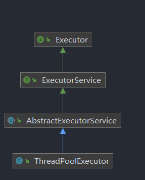

## 线程池的基础关系

// 线程数的数量越多越好 错误

        /**
         *      return new ThreadPoolExecutor(0, Integer.MAX_VALUE,   核心线程数0， 最大线程数 无穷大
         *                                       60L, TimeUnit.SECONDS,
         *                                       new SynchronousQueue<Runnable>());  同步队列， 节点只有一个， 只能存一个任务
         */
        // 多少任务多少个线程， (任务执行时间短时线程复用， 一人做多个项目)
        // 快   不会出现内存溢出  只有一个节点， 内存占用少
        ExecutorService executorService1 = Executors.newCachedThreadPool();

        /**
         *        return new ThreadPoolExecutor(nThreads, nThreads,    核心线程数10 ,  最大线程数 1O
         *                                       0L, TimeUnit.MILLISECONDS,
         *                                       new LinkedBlockingQueue<Runnable>()); 队列比较长
         *                                       队列中排序
         *  线程数为 10 ，
         */
        // 慢   OOM 会出现内存溢出（超级计算机硬件有关）  核心线程数的多少
        ExecutorService executorService2 = Executors.newFixedThreadPool(100);
        /***
         *         return new FinalizableDelegatedExecutorService
         *             (new ThreadPoolExecutor(1, 1,
         *                                     0L, TimeUnit.MILLISECONDS,
         *                                     new LinkedBlockingQueue<Runnable>()));
         */
        // 最慢的 会出现内存溢出  单个线程   是ThreadPoolExecutor 的单一版本   个体户
        ExecutorService executorService3 = Executors.newSingleThreadExecutor();

        // 阿里巴巴推荐使用自定义线程池   非核心  20 -10 = 10 个
        // 提交优先级 ：核心线程 >
        // 执行优先级 ： 那里有任务就在哪里执行
        ThreadPoolExecutor threadPoolExecutor4 = new ThreadPoolExecutor(10, 20,
                0L, TimeUnit.MILLISECONDS, new ArrayBlockingQueue<Runnable>(10)
//                new RejectedExecutionHandler() {
//                    @Override
//                    public void rejectedExecution(Runnable r, ThreadPoolExecutor executor) {
//
//                    }
//                }
);

        for (int i =1; i<= 100; i++){
            threadPoolExecutor4.execute(new MyTask(i));
        }
